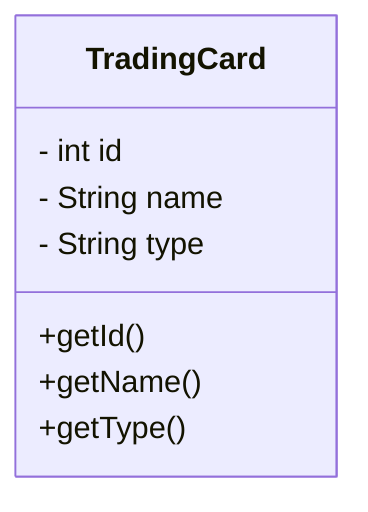

### Map
##### Théorie
Les maps, fonctionnent sur un principe de clef-valeur.
Comme les listes, ce sont des classes "génériques". C'est à dire qu'on doit explicitement préciser le type de notre clef ainsi que le type de notre valeur. Par exemple, si on veut enregistrer la couleur de chacune des pièces d'une maison, on peut l'enregistrer sous forme de `map` => `Map<String, Color>`.

Comme pour les `List`, il existe plusieurs sorte de `Map` telles que `HashMap`, `LinkedHashMap`, `TreeMap`. Celle à laquelle vous aurez le plus souvent à faire est la `HashMap`.

Exemple
```Java
Map<String, Color> colorByRoom = new HashMap<>();
colorByRoom.put("Salon", Color.RED);
colorByRoom.put("Chambre à coucher", Color.GREEN);
colorByRoom.put("Salle à manger", Color.BLUE);
```

**Les méthodes utiles des `Map`**
Comme pour les `List`, il existe beaucoup de méthodes sur les `Map`. Les plus utiles sont les suivantes:
- put(key, value) qui permet d'ajouter un élément dans la Map. Attention cependant, si on lui passe une clef déjà existante dans la `Map`, sa valeur sera remplacée.
- `size()` qui retourne le nombre de clef présentes dans une `Map`.
- `isEmpty()` qui retourne `true` si la `Map` est vide et `false` si elle contient un élément.
- `containsKey(key)` qui prends une clef en paramètre et qui retourne `true` si la `Map` contient cette clef et `false` sinon
- `containsValue(value)` même principe que `containsKey()` mais pour les valeurs.
- `values()` qui retourne une `Collection` des valeurs présentes dans chaque clef de la `Map`.

##### Informations
Pour ce TP, la classe `TradingCard` a été créée pour vous. Elle se présente comme suit

La classe `MapTest` vous permettra d'ajouter le code nécessaire à son fonctionnement.

##### À faire
- Créer une map comprenant, en clef, le type et en valeur, une liste de carte de ce type là.
- Créer une map comprenant, en clef, le nom de la carte et en valeur, le nombre de cartes correspondants à ce nom.
- Remettre les liste de chaque clef à 0
