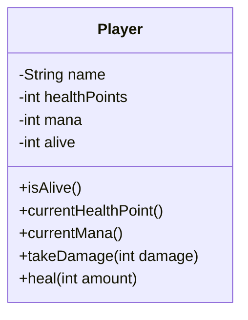

## Méthodes
Le but de ce TP est de démontrer la création et l'utilisation des méthodes.

### Théorie
Les méthodes, dans un langage de programmation, nous permettent de sectionner notre code en morceaux réutilisable.
Un exemple simple, serait celui de fonctions arithmétiques.
Si on veut additionner deux nombres entre eux, on peut créer une méthode pour cela, si on veut les multiplier aussi, diviser, etc.
Une méthode, en java, suit le format suivant `[visibilité] [type de retour] [nom de la méthode]([type du paramètre s'il y en a] [nom du paramètre s'il y en a]...)`

En suivant cette syntaxe, si on voulait maintenant créer une méthode d'addition, de multiplication et de division simple
(uniquement des nombre entiers), il nous suffirait d'écrire le code suivant:
```Java
public int add(int a, int b) {
    return a + b;
}

public int subtract(int a, int b) {
    return a - b;
}

public int multiply(int a, int b) {
    return a * b;
}

public float divide(int a, int b) {
    return a / b;
}
```
L'utilisation d'une méthode est basée sur sa déclaration. Si la déclaration contient 2 paramètres, alors nous
sommes obligé de remplir les paramètres requis. Par contre, le nom des variables qu'on passe à notre méthode n'a aucune
importance. On peut tout à fait nommer nos variables n'importe comment et la méthode sera tout à fait capable de s'en sortir.
```Java
int OwO = 10;
int UwU = 20;
int resultat = add(OwO, UwU);
// Résultat attendu : 30
```

### Informations
Dans ce TP, on va s'assurer que les méthodes permettent bien à un joueur de
* Recevoir un certain nombre de dégats.
* Se soigner d'un certain nombre de points de vie.
* Retourner son nombre actuel de HP.
* Retourner son nombre de MP actuel.

### À faire
* Créer une classe Player

* Dans la classe `MethodsTest`
  * Faire compiler, en suivant les indications, les divers tests
  * Scénario du test `fightShouldOccurCorrectly` à implémenter
    * **instancier** *2 joueurs* avec les informations suivantes

      | Information | Joueur 1 | Information | Joueur 2 |
            | :---------- | :------: | :---------- | :------: |
      | Nom         | Liliana  | Nom         |  Gideon  |
      | Points      |    20    | Points      |    20    |
      | Mana        |    2     | Mana        |    2     |

      * `Joueur 1` a reçu `5 points de dégats`
      * `Joueur 1` a reçu `0 HP`
      * `Joueur 2` a reçu `10 points de dégats`
      * `Joueur 2` a été soigné de `3 HP`
  * Une fois le scénario implémenté, il faudra lancer le test et s'assurer qu'il passe.
