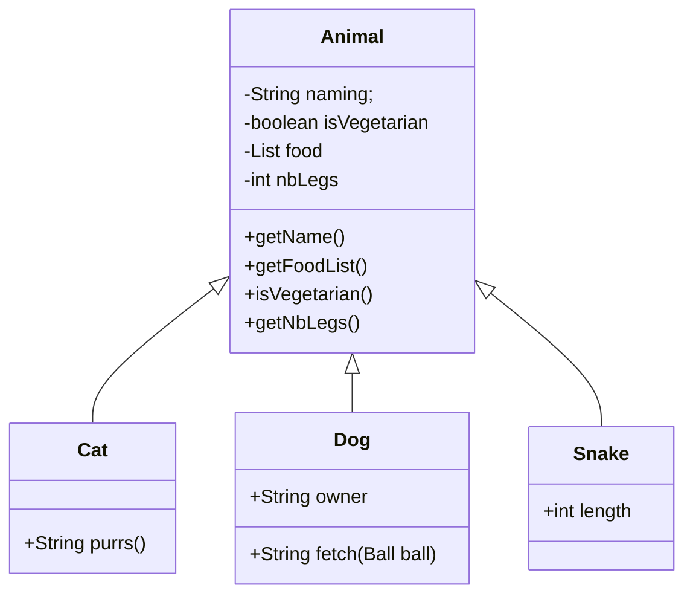
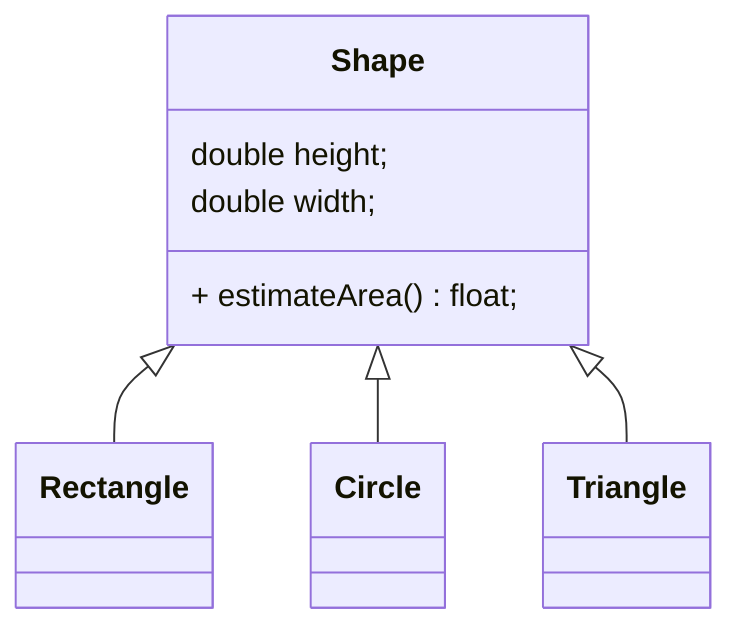
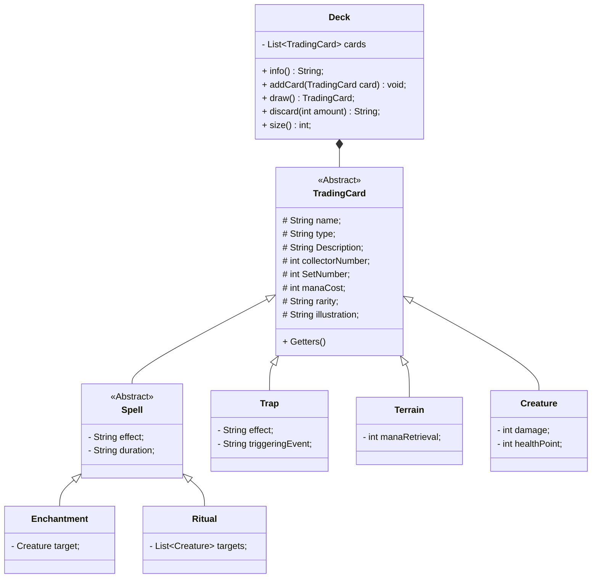

# Heritage
Ce TP a pour but de prendre connaissance du fonctionnement de l'héritage.

## Théorie
Toutes les classes Java, héritent par défaut de la classe `Object`. C'est à dire qu'elles auront accès à toute une série de méthodes et d'attributs prédéfinis dans la classe `Object`. C'est le cas, par exemple de `toString`, `compare` et `equals` que nous avons vu dans les TP précédents.\

Une classe qui hérite d'une autre aura accès à tous les `attributs` ainsi que les `méthodes` qui ont une visibilité `protected` ou `public`. Les attributs et méthodes de type `private` seront caché de tous le monde. Même les classes enfants.\
D'où l'intérêt de bien réfléchir à la visibilité qu'on veut donner à un `attribut` ou une `méthode`.

Quel est l'intérêt de l'héritage ? On utilisera l'héritage sert dès lors que l'on veut spécialiser des comportements pour chaques éléments.\
L'exemple le plus connu est celui des Animaux ou des Véhicules.

Je peux donc avoir une `List<Animal>` qui contiendra des animaux. Vu que toutes mes classe (`Dog`, `Cat`, `Snake`) héritent de la classe `Animal`, je sais qu'elles auront toutes accès aux méthodes contenues dans la classe `Animal`.\
Par conséquent, je sais que je peux appeler une de ces méthodes sans me poser de question.
```Java
List<Animal> animals = new ArrayList<>();

animals.forEach(animal -> System.out.println("L'animal " + animal.getName() + " a " + animal.getNbLegs() + " pattes");
```
Cependant, je sais aussi que je ne pourrai pas, sur un `Animal`, utiliser une des méthodes des classes enfant.\
Je ne peux, par exemple pas faire :
```Java
animals.forEach(animal -> System.out.println(animal.purrs()));
```
La classe animal n'a pas connaissance de cette particularité qui est propre au chat. Je peux cependant, instancier un chat et appeler ses méthodes sans problème.
```Java
Cat cat = new Cat();
cat.purrs();
```
### Polymorphisme 
Un point important de l'héritage est qu'il permet le polymorphisme. Qu'est-ce que ça veut dire ? \
Le polymorphisme représente la capacité de chaque classe enfant de remplacer le comportement d'une méthode parent.\
Dans notre exemple, on pourrait imaginer une alternative pour laquelle la classe `Animal` aurait une méthode `move()` qui de base printerait _"marche"_. \
Les animaux qui ne marchent pas mais nagent, par exemple, pourraient donc, au moyen de l'annotation `@Override`, modifier le comportement de la méthode pour qu'elle print _"nage"_. C'est un exemple très basique mais on peut l'adapter à des formes.

Ici, chaque forme a une méthode différente pour calculer son air.
```Java
class Shape {
    protected double height;
    protected double width;
    
    public float estimateArea() {
        return this.height * this.width;
    }
}

class Rectangle extends Shape {
    // Nothing to do, it behaves like a regular shape
}

class Circle extends Shape {
    double radius;
    
    public Circle(double height, double width) {
        this.height = height;
        this.width = width;
        this.radius = width / 2;
    }
    
    @Override
    public float estimateArea() {
        return Math.PI * Math.pow(radius, 2);
    }
}


class Triangle extends Shape {
  
    public Circle(double height, double width) {
        this.height = height;
        this.width = width;
    }
  
    @Override
    public float estimateArea() {
        return (this.height * this.width) / 2;
    }
}
```
Une fois que chacune des formes a défini son air, il m'est alors possible de prendre n'importe quelle forme et d'appliquer la méthode `estimateArea` pour en connaitre l'air. \
```Java
public void main() {
    List<Shape> shapes = new ArrayList<Shape>();
    shapes.add(new Rectangle(4, 5));
    shapes.add(new Circle(4, 4));
    shapes.add(new Triangle(5, 6));
    
    shapes.forEach(listShape -> System.out.println(listShape.estimateArea()));
    
    // Expected output:
    // 20 <- Air du rectangle
    // 12.56 <- Air du Cercle
    // 15 <- Air du Triangle
}
```
C'est là que réside la puissance du polymorphisme.
### Abstraction
L'abstraction, en programmation orienté objet nous permet de définir une classe "modèle" qui ne sera pas instanciable. Pour l'utiliser, il faudra nécessairement l'`extends` et implémenter les méthodes abstraites qui en font partie.\
Pour reprendre l'exemple des `Shape`, on peut se dire que de base, une forme peut être une classe abstraite puisqu'elle ne représente rien de "réel". Elle est conceptuelle. \
Si on voulait en faire une classe abstraite, on pourrait alors la définir comme tel:
```Java
abstract class Shape {
    public abstract float estimateArea();
}
```
Ici, on informe la personne qui va vouloir utiliser notre classe qu'elle va devoir définir sa propre vision de `Shape` ainsi que son implémentation de `estimateArea()` qui, elle aussi, est abstraite. On peut définir une classe comme étant abstraite mais aussi une méthode/fonction. De cette manière, on a pas besoin de définir le comportement de la méthode mais simplement le "contrat" qui devra être rempli par les classes qui étendent notre classe abstraite. C'est le même principe qu'une interface en un peu plus puissant.\
Pour reprendre notre exemple, précédent, ce changement va nous obliger à définir, dans rectangle, le comportement attendu. 
```Java
class Rectangle extends Shape {
    @Override
    public float estimateArea() {
        return this.height * this.width;
    }
}
```
Attention cependant, une classe abstraite peut aussi définir les comportements par défaut de ses méthodes. Rien ne nous empêche, dans notre exemple précédent, de décider que le comportement par défaut reste celui qui dit que `estimateArea()` vaut, par défaut `this.height * this.width`.
```Java
abstract class Shape {
    public float estimateArea() {
        return this.height * this.width;
    }
}
```
La classe reste abstraite donc non-instanciable mais ses enfant héritent du fonctionnement de base de `estimateArea()`;

## Informations pour les exercices
Dans notre cas, nous avons une collection de cartes. Chaque carte peut être, soit un *Sort*, une *Créature*, un *Terrain* ou encore un *Piège*. Les sorts sont eux-même divisés en deux catégories, à savoir: *Instantané* et *Rituel*.

Ce qui nous donne le diagram de classe suivant:


## À faire
- Créer les classes correspondantes au diagramme ci-dessus.
- La classe `InheritanceTest` contient plusieurs tests incomplets. 
  - Ajouter le code manquant afin qu'elle compile.
  - Lancer les tests et s'assurer qu'ils passent tous.
  - Utiliser les notions présentées au-dessus.
