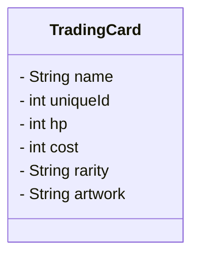

#### Equals
Une carte peut avoir des alterations d'artwork. Dans notre exemple, on estime qu'une carte, non-alterée est "la même" que sont équivalent altérée. \
Dans ce Tp, l'idée est de comprendre comment la méthode `equals()` fonctionne et ce pourquoi elle peut être utile.\
Il est simplement demandé d'ajouter une méthode equals qui va vérifier si une carte est "la même" qu'une autre carte. \
*Pour cela, la classe `CompareCardsTest` vous est mise à disposition et les tests y sont déjà écrits.*
\
##### Règle de gestion
- Une carte est considérée équivalente si son nom est identique à celui de la carte comparée.
    - Exemple: `Black lotus` est égal à : `black lotus`, `BLACK LOTUS`, `bLaCk LoTuS`, `black LOTUS`, etc.
##### À faire
- Créer la classe `TradingCard`

- Implémenter la méthode `equals(...)` permettant de comparer les cartes selon la règle de gestion précisée ci-dessus.
- Faire compiler la classe `CompareCardsTest` en y ajoutant les informations requises
- Dans la classe `RepartitionDeckTest`, le test `EnsureDeckRepartition` n'est actuellement pas fonctionnel. Référez-vous à la liste des cartes pour le faire passer.
